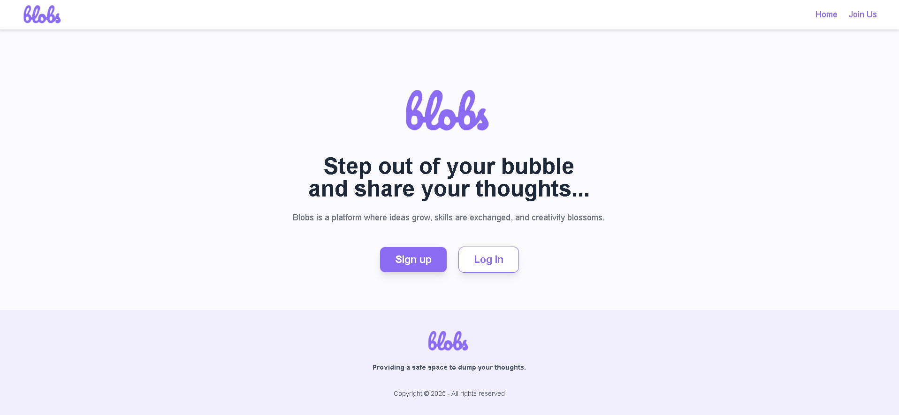
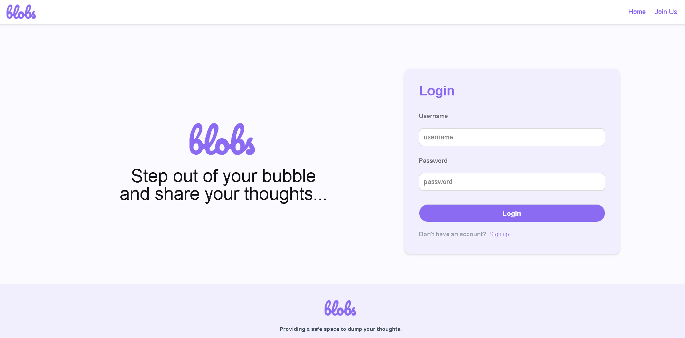
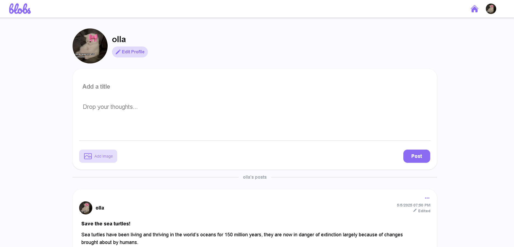
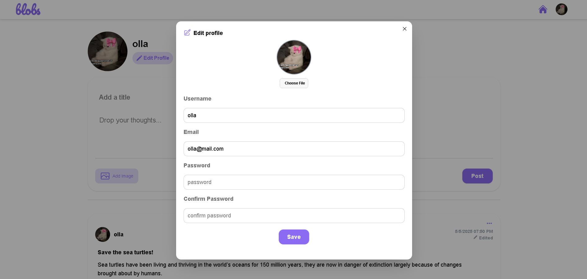
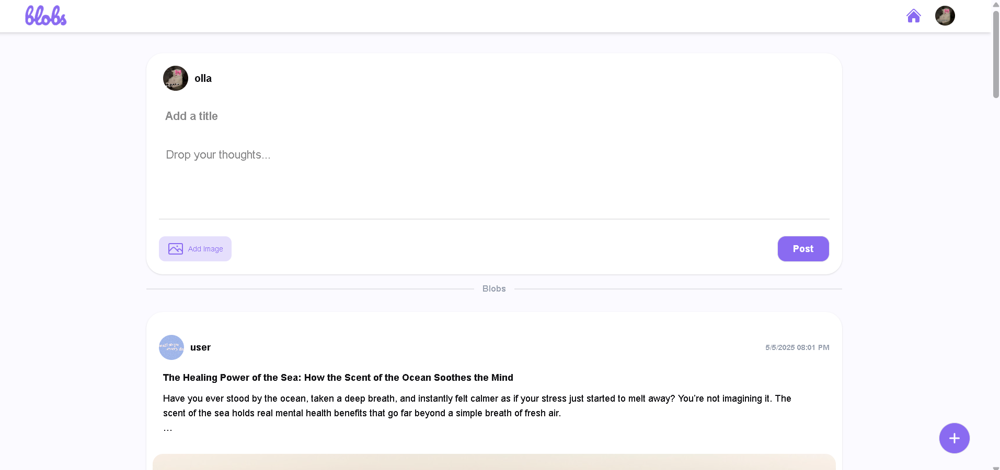
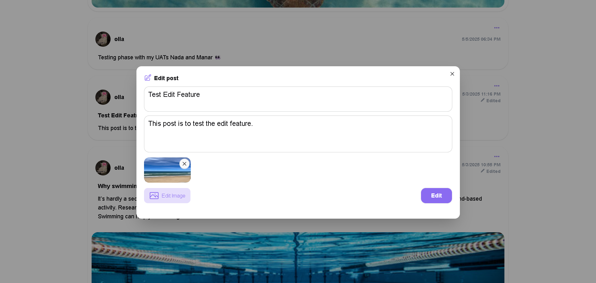
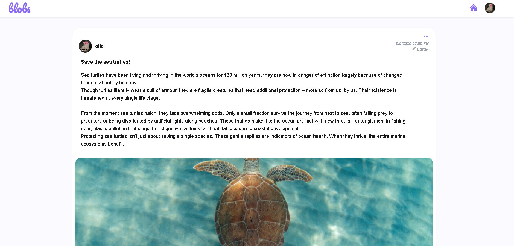

# 📝 Blogs Web Application (MERN Stack)

A full-stack **MERN** (MongoDB, Express, React, Node.js) blogging platform that lets users create, read, update, and delete blog posts — with a modern, responsive interface.

---

## 🚀 Features

- 🔐 User Authentication using JWT
- 📝 Full CRUD for blog posts
- 💡 Responsive UI with Tailwind CSS
- ⚙️ RESTful API with Express
- 🧠 MongoDB for flexible data storage

---

## 🛠 Tech Stack (MERN)

### Frontend
- ReactJS
- Tailwind CSS

### Backend
- Node.js
- Express.js
- MongoDB/Mongoose

---

## ⚙️ Installation

### Clone the repository

```bash
git clone https://github.com/your-username/blogs-web-app.git
cd blogs-web-app 
```

### ⚙️ Backend Setup

```bash
cd backend
npm install
npm run dev
```

### 🎨 Frontend Setup

```bash
cd ../frontend
npm install
npm run dev
```

### 🔑 Environment Variables
In the /backend directory, create a .env file with:
```
PORT=5000
MONGO_URI=your_mongodb_connection_string
JWT_SECRET=your_jwt_secret
```

## 📸 Screenshots

### 🙌 Join Us Page


### 🔐 Login Page


### 📝 Register Page


### 👤 Profile Page


### 🔧 Edit Profile


### 🏠 Home Page


### ✏️ Edit Post Page 


### 📝 Blog Post Page


## 🔗 Live Demo

Check out the live version here: [🌐 View Demo](https://blobs-xi.vercel.app/)

## 🎥 Demo Video

Want a quick tour? Watch the demo video here:  
[Watch Demo](https://drive.google.com/file/d/1Fc9_Arxk_h_jcWgMwnlwtNjpQAgigzkI/view?usp=drive_link)
